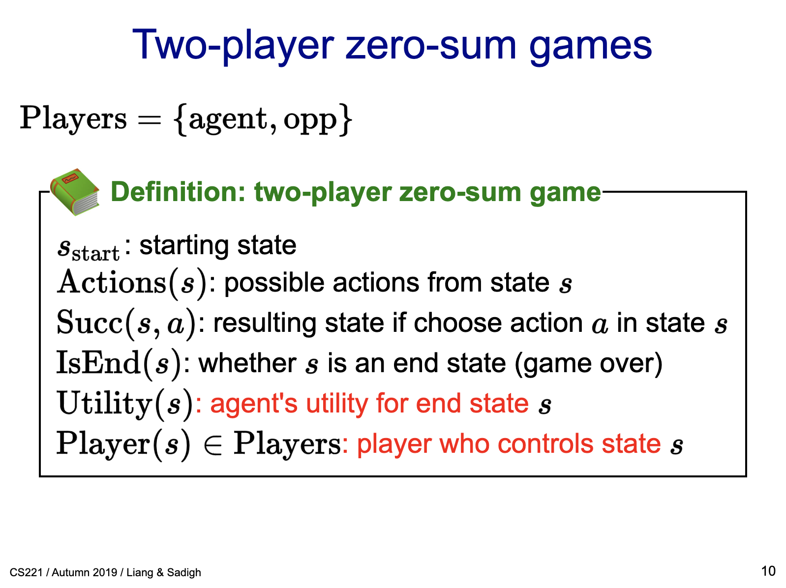
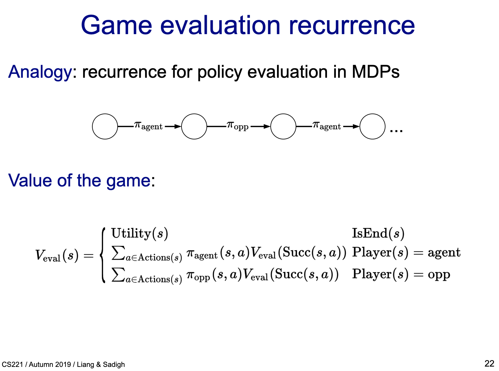
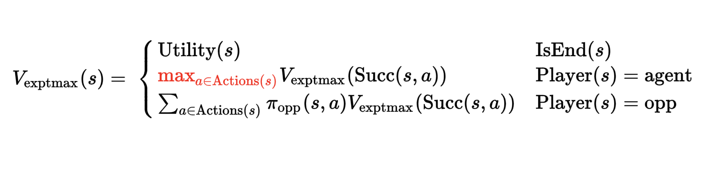

# Game Playing

AI Game Playing


* HalfingNumber
### Game Definition



The HalvingNumber game. See the [code](https://github.com/xianminx/ai-chinese-chess/tree/main/src/app/games/halvingnumber) and [demo](https://ai-chinese-chess.vercel.app/games/halvingnumber):
[Visualization of HalvingNumber](https://ai-chinese-chess.vercel.app/games/halvingnumber)


* Policy 


* Game Tree
* Minimax
* Alpha-beta pruning
* TD Learning


* Game Evaluation Recurrence 



    V(s): 
    * Utility(s) if isEnd(s)
    * Sum(p(s, a) * V(succ(s, a))) for all a in actions(s)


* Expectimax recurrence




* Minimax 
assume the worst case: the opponent will play his best move, so we can use the minimax to find the best move.

```
V(s) = max(V(s')) for all s' in succ(s)
where V(s') is the opponent's best move, and the opponent is min(V(s')) for all s' in succ(s')
```

### MDP 

* [Markov decision process](https://en.wikipedia.org/wiki/Markov_decision_process)
* [Markov Decision Processes 1 - Value Iteration | Stanford CS221: AI (Autumn 2019)](https://www.youtube.com/watch?v=9g32v7bK3Co&list=PLoROMvodv4rOca_Ovz1DvdtWuz8BfSWL2&index=19)
* [Markov Decision Processes 2 - Reinforcement Learning | Stanford CS221: AI (Autumn 2019)](https://www.youtube.com/watch?v=HpaHTfY52RQ&list=PLoROMvodv4rOca_Ovz1DvdtWuz8BfSWL2&index=20)
* [Game Playing 1 - Minimax, Alpha-beta Pruning | Stanford CS221: AI (Autumn 2019)](https://www.youtube.com/watch?v=3pU-Hrz_xy4&list=PLoROMvodv4rOca_Ovz1DvdtWuz8BfSWL2&index=21)
* [Game Playing 2 - TD Learning, Game Theory | Stanford CS221: Artificial Intelligence (Autumn 2019)](https://www.youtube.com/watch?v=WoFwXj4p4Sc&list=PLoROMvodv4rOca_Ovz1DvdtWuz8BfSWL2&index=22)
* [中國象棋遊戲 | Xiangqi chess engine in javascript: negamax search with alpha beta pruning](https://www.youtube.com/watch?v=OqdZkx7PKmM)